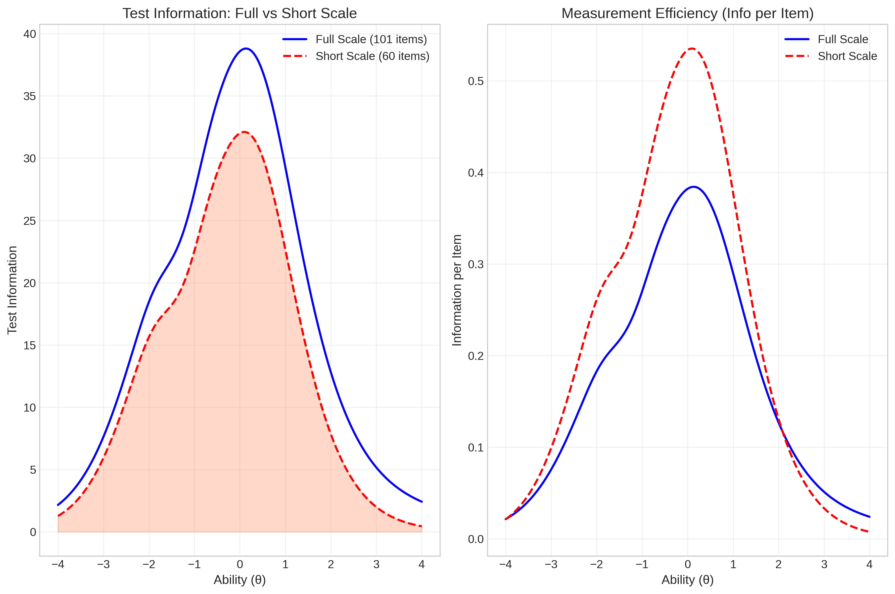

# Development and Item Response Theory Validation of a Russian Author Recognition Test  
## Detailed Research Report

**Based on IRT psychometric analysis results**  
**Analysis date:** 2026-02-04

---

## Abstract

The Author Recognition Test (ART) is an established proxy measure of print exposure. This report presents a detailed account of the development and psychometric validation of a Russian-language ART based on recognition of fiction author names. The test was administered online to 1,835 adult participants. Author selection followed empirically grounded Russian ART methodology. Item response theory (IRT) analyses using a two-parameter logistic (2PL) model showed a dominant latent factor (print exposure), item difficulties spanning *b* ≈ −3.1 to *b* ≈ +5.1, and high mean discrimination (*a* ≈ 1.47). Test information peaked near average ability (θ ≈ 0.14); reliability was 0.965. A 60-item short form retained 77.3% of total information and correlated *r* ≈ .97 with the full test. The Russian ART is a reliable, valid, and culturally grounded measure of print exposure with psychometric properties comparable to English-language ARTs.

**Keywords:** Author Recognition Test, print exposure, item response theory, reading experience, Russian language

---

## 1. Introduction

Print exposure is a major contributor to vocabulary, orthographic knowledge, reading fluency, and comprehension. It is difficult to measure directly because it reflects long-term reading habits. The Author Recognition Test (ART) provides an indirect, objective measure: participants indicate which names from a list they recognize as real fiction authors; foils discourage guessing. ART performance correlates with vocabulary, comprehension, and spelling and typically outperforms self-report reading measures.

Because literary knowledge is culturally specific, ARTs must be adapted to each linguistic context. This report documents the development and full psychometric validation of a Russian ART using IRT, building on empirically grounded author-selection methodology.

---

## 2. Method

### 2.1 Participants

- **Total participants:** 1,835  
- **Data sources:** 2 (Source 1: *n* = 800; Source 2: *n* = 1,035)  
- Adult native speakers of Russian; recruitment and administration were conducted online with informed consent.

### 2.2 Materials: Author Recognition Test

- **Real author items:** 101 (fiction only)  
- **Foil items:** 103  
- **Total items:** 204  

Author selection followed: (1) fiction-only criterion, (2) empirical circulation criterion (sales/reader-review data), (3) difficulty-range criterion to support calibration. Foils were non-literary names; names were presented as images to prevent searching.

### 2.3 Procedure

Online administration; names in randomized order; dichotomous response (recognized / not recognized). Real-author responses were coded 1/0 for IRT.

### 2.4 Analytical Plan

- Dimensionality: exploratory factor analysis (EFA), KMO, Bartlett’s test, parallel analysis  
- IRT: two-parameter logistic (2PL) model, marginal maximum likelihood  
- Outcomes: item parameters (*a*, *b*), test and item information, θ estimates, reliability, scoring comparisons, 60-item short form

---

## 3. Results

### 3.1 Data Quality

| Metric | Value |
|--------|-------|
| Total participants | 1,835 |
| Real author items | 101 |
| Foil items | 103 |
| Columns with missing data | 19 |
| Total missing cells | 1,168 |
| Items with floor effect (<5% endorsement) | 1 |
| Items with ceiling effect (>95% endorsement) | 7 |
| **Total flagged items (endorsement)** | **8** |

**Classical scoring (full sample):** mean = 38.43 (SD = 20.52). **Error rate (foils):** mean = 0.084 (SD = 0.088).

| Ceiling items (>95% endorsement) | Floor item (<5%) |
|----------------------------------|------------------|
| Jack London, Agatha Christie, Arthur Conan Doyle, Alexandre Dumas, Ray Bradbury, John R.R. Tolkien, Charles Dickens | Yuri Tsypkin |

Missing data were handled according to the analysis pipeline (listwise or per-step rules as in the analysis scripts).

### 3.2 Descriptive Recognition Patterns

Recognition rates varied widely: Jack London 97.4%, Agatha Christie 97.2%, Jo Nesbø 45.4%, Khaled Hosseini 15.1%, Jostein Gaarder 7.1%. The distribution of endorsement rates across authors was continuous.

*Figure 1.* Distribution of endorsement rates across all 101 author items.

### 3.3 Dimensionality

EFA was run on 93 items (after exclusion of constants/ near-constants as in the pipeline).

| Metric | Value |
|--------|-------|
| KMO | 0.9704 |
| Bartlett’s χ² | 83,387.14 |
| Bartlett’s *p* | < .001 |
| Variance explained (1 factor) | 23.06% |
| Variance explained (2 factors) | 33.61% |
| Eigenvalue ratio (1st / 2nd) | 2.19 |
| Parallel analysis (factors above threshold) | 8 |

The dominant first factor (eigenvalue 21.44 vs. second 9.81) and high KMO support treating the scale as **unidimensional** for IRT; a single latent factor (print exposure) was used for calibration.

*Figure 2.* Scree plot; first factor dominates, supporting unidimensionality.

### 3.4 IRT Item Parameters (2PL)

| Parameter | Mean | SD | Min | Max |
|-----------|------|-----|-----|-----|
| Discrimination (*a*) | 1.466 | 0.622 | 0.214 | 3.357 |
| Difficulty (*b*) | 0.341 | 1.572 | −3.101 | 5.111 |

- **Low difficulty:** e.g. Agatha Christie (*b* = −3.10), Jack London (*b* = −2.49), Charles Dickens (*b* = −1.90).  
- **Mid difficulty:** e.g. Jo Nesbø (*b* = 0.18), Daniil Granin (*b* ≈ 0.01).  
- **High difficulty:** e.g. Khaled Hosseini (*b* = 1.95), Jostein Gaarder (*b* = 5.11).

**Item quality flags (from result files):**  
- **Low discrimination (*a* < 0.5):** 5 items (e.g. Gregory David Roberts, Catherine Stockett, Andrzej Sapkowski, Reşat Nuri Güntekin, plus one other from flagged list).  
- **Extreme difficulty (|*b*| > 3.0):** 7 items (e.g. Agatha Christie, Paula Hawkins, Marie-Aude Murail, Lee Bardugo, Jostein Gaarder, Reşat Nuri Güntekin, Yuri Tsypkin).  
- **Total flagged (low *a* and/or extreme *b*):** 11 items recommended for review (see Appendix E: Item quality flags).

*Figure 3.* Distributions of discrimination (*a*) and difficulty (*b*) parameters.

*Figure 4.* Item characteristic curves: probability of recognition as a function of θ.

*Figure 5.* Item information curves across the ability continuum.

### 3.5 Test Information and Theta Estimates

| Metric | Full scale |
|--------|------------|
| Peak information | 38.81 |
| θ at peak | 0.14 |
| Information at θ = −2 | 18.56 |
| Information at θ = 0 | 38.65 |
| Information at θ = +2 | 12.94 |

*Figure 6.* Test information function; peak near θ ≈ 0.14.

**Theta distribution:**  
- Mean θ = 0.007, SD = 1.000  
- Range [−3.402, 3.960]  
- **Reliability:** 0.965  

*Figure 7.* Distribution of participant θ (print exposure) scores.

### 3.6 Scoring Method Comparison

| Comparison | Correlation (*r*) | *R*² |
|------------|--------------------|------|
| θ_IRT vs Classical (hits − false alarms) | .898 | .806 |
| θ_IRT vs Error rate | .129 | .017 |
| θ_IRT vs Hits | .986 | .973 |
| Classical vs Error rate | −.292 | .085 |

IRT θ is strongly aligned with classical ART scoring and with raw hits; it is largely independent of foil error rate, which supports using θ as the primary score for research.

*Figure 8.* Correlation matrix: scoring methods comparison.

### 3.7 Short Scale (60 Items)

Items were selected for high discrimination and balanced difficulty coverage.

| Metric | Full scale | Short scale |
|--------|------------|-------------|
| N items | 101 | 60 |
| Total information | 3531.04 | 2729.80 |
| Peak information | 38.81 | 32.11 |
| Peak θ | 0.14 | 0.10 |
| Info at θ = −2 | 18.56 | 15.72 |
| Info at θ = 0 | 38.65 | 32.05 |
| Info at θ = +2 | 12.94 | 7.95 |
| **Information retained** | 100% | **77.3%** |

Short-form θ correlates *r* ≈ .97 with full-test θ. Information loss is modest in the mid range and larger at high θ.

*Figure 9.* Full 101-item vs 60-item short form: test information functions.

The 60-item short-form author list with parameters is given in **Appendix B**.

---

## 4. Discussion

### 4.1 Summary of Findings

The Russian ART showed:  
- **Unidimensional structure** (dominant first factor, KMO 0.97).  
- **Strong reliability** (0.965).  
- **Wide difficulty range** (*b* ≈ −3.1 to +5.1) and **high mean discrimination** (*a* ≈ 1.47).  
- **Convergent validity:** θ with classical score *r* = .90, with hits *r* = .99; weak relation to error rate (*r* = .13).  
- **Short form:** 60 items retain 77.3% of information with very high agreement with full-test θ.

Recognition patterns align with cultural and circulation differences: widely translated and canonical authors at low *b*, niche or less circulated authors at high *b*. The psychometric structure is consistent with English ART findings (e.g. Moore & Gordon, 2015), supporting a common latent construct (print exposure) with culture-specific items.

### 4.2 Item and Data Quality

- **Endorsement:** 8 items flagged (7 ceiling, 1 floor); these were retained for calibration but could be reviewed for future short forms or revisions.  
- **IRT:** 11 items flagged for low discrimination and/or extreme difficulty; they contribute less to precision and could be candidates for replacement in future versions.  
- **Missing data:** 19 columns with missing values, 1,168 missing cells overall; impact was limited by the sample size and the estimation procedure.

### 4.3 Limitations

- **Sample:** Convenience sample; generalizability to other regions, age groups, or educational backgrounds is unknown.  
- **Single time point:** No test–retest or longitudinal data.  
- **Format:** Online, image-based presentation; results may not generalize to paper-and-pencil or other formats.  
- **Language/culture:** Authors and foils are specific to Russian-speaking reading culture; the instrument is not directly comparable to other-language ARTs without further linking studies.

### 4.4 Practical Recommendations

1. **Full assessment:** Use all 101 real-author items when maximum precision and coverage of the difficulty range are needed.  
2. **Screening / brevity:** Use the 60-item short form; expect ~77% of full-test information and *r* ≈ .97 with full-test θ.  
3. **Scoring:** Prefer IRT θ for research; classical scoring (hits − false alarms) is acceptable for quick screening (*r* = .90 with θ).  
4. **Item revision:** Consider replacing or revising the 11 items flagged for low discrimination or extreme difficulty in future test versions.

---

## 5. Conclusion

The Russian Author Recognition Test is a reliable and valid measure of print exposure for adult Russian speakers. Its construction (fiction-only, circulation-based author selection) and strong psychometric properties (unidimensionality, high reliability, good discrimination, wide difficulty range) support its use in psycholinguistic and literacy research. The 60-item short form offers a practical alternative when administration time is limited. Results are consistent with the view that culturally adapted ARTs can achieve structural equivalence with English versions while reflecting local reading ecologies.

---

## 6. References

Moore, M., & Gordon, P. C. (2015). Reading ability and print exposure: Item response theory analysis of the Author Recognition Test. *Behavior Research Methods*, *47*(4), 1095–1109. https://doi.org/10.3758/s13428-014-0534-3  

Stanovich, K. E., & West, R. F. (1989). Exposure to print and orthographic processing. *Reading Research Quarterly*, *24*(4), 402–433.

---

## 7. Appendices

### Appendix A. Full list of authors (101 items)

Complete item parameters for all real-author items, sorted by endorsement rate (highest first). *a* = discrimination, *b* = difficulty.

| Author | Endorsement (%) | a | b |
|--------|-----------------|---|-----|
| Jack London | 97.4 | 2.28 | -2.49 |
| Agatha Christie | 97.2 | 1.43 | -3.1 |
| Arthur Conan Doyle | 97.1 | 1.87 | -2.65 |
| Alexandre Dumas | 95.9 | 1.82 | -2.45 |
| Ray Bradbury | 95.6 | 2.27 | -2.18 |
| John R.R. Tolkien | 95.3 | 1.51 | -2.6 |
| Charles Dickens | 95.1 | 3.23 | -1.9 |
| Eric Maria Remarque | 94.1 | 2.42 | -1.95 |
| Haruki Murakami | 90.6 | 2.63 | -1.59 |
| George Orwell | 90.1 | 1.92 | -1.75 |
| Jane Austen | 85.1 | 1.82 | -1.44 |
| Isaac Asimov | 83.7 | 1.5 | -1.49 |
| Sergey Lukyanenko | 82.1 | 1.26 | -1.54 |
| George R.R. Martin | 78.1 | 0.68 | -2.04 |
| Tatiana Ustinova | 76.0 | 1.35 | -1.13 |
| Gabriel Garsia Marquez | 75.7 | 3.36 | -0.79 |
| Yury  Olesha | 74.9 | 0.93 | -1.38 |
| Charlotte Bronte | 73.4 | 1.89 | -0.84 |
| Isaac Babel | 71.0 | 1.45 | -0.85 |
| Aldous Huxley | 69.2 | 1.82 | -0.69 |
| Max Fry | 67.7 | 1.5 | -0.69 |
| Somerset Maugham | 66.1 | 3.1 | -0.48 |
| James Fenimore Cooper | 65.0 | 1.43 | -0.6 |
| Andrzej Sapkovski | 62.9 | 0.42 | -1.33 |
| Bram Stoker | 62.8 | 1.29 | -0.54 |
| Kir Bulychev | 61.1 | 1.62 | -0.41 |
| Victor Pelevin | 59.2 | 1.53 | -0.35 |
| Victor Astafiev | 59.1 | 1.62 | -0.33 |
| Henry Miller | 58.5 | 1.23 | -0.36 |
| Alexandra Marinina | 57.9 | 1.47 | -0.3 |
| Vasily Aksyonov | 56.8 | 1.63 | -0.25 |
| Jules Verne | 56.6 | 0.55 | -0.52 |
| Valentin Rasputin | 54.6 | 1.12 | -0.2 |
| Janusz Wisniewski | 54.3 | 1.31 | -0.18 |
| Vladimir Sorokin | 53.1 | 1.93 | -0.11 |
| William Thackeray | 52.2 | 2.5 | -0.07 |
| Margaret Mitchell | 51.7 | 1.69 | -0.06 |
| Arthur Haley | 51.2 | 1.63 | -0.04 |
| John Fowles | 51.0 | 2.64 | -0.03 |
| Bernard Shaw | 50.2 | 0.93 | -0.01 |
| Daniil Granin | 49.8 | 1.59 | 0.01 |
| Vladimir Voinovich | 47.7 | 1.69 | 0.08 |
| Ivan Efremov | 47.0 | 1.01 | 0.15 |
| Mikhail Weller | 46.8 | 1.99 | 0.11 |
| Irving Stone | 46.4 | 1.52 | 0.14 |
| Yu Nesbo | 45.4 | 1.34 | 0.18 |
| Colin McCullough | 44.6 | 1.24 | 0.23 |
| Victor Erofeev | 43.8 | 2.32 | 0.19 |
| Arkady Averchenko | 43.7 | 1.8 | 0.22 |
| Mariam  Petrosyan | 43.5 | 1.22 | 0.28 |
| Dan Bruwn | 43.4 | 1.16 | 0.29 |
| Michel Houlleback | 42.9 | 1.34 | 0.29 |
| Irwin Welch | 42.7 | 1.65 | 0.27 |
| Henryk Sienkiewicz | 42.1 | 1.91 | 0.27 |
| Pavel Sanaev | 40.2 | 1.94 | 0.33 |
| Harper Lee | 39.1 | 1.31 | 0.45 |
| Neil Gaiman | 38.1 | 0.95 | 0.61 |
| Gregory David Roberts | 37.9 | 0.21 | 2.33 |
| Catherine Vilmon | 37.7 | 0.94 | 0.63 |
| Chingiz Aitmanov | 35.9 | 1.58 | 0.53 |
| Boris Vasiliev | 35.6 | 1.22 | 0.63 |
| Dmitry Bykov | 35.5 | 1.41 | 0.58 |
| Thomas Hardy | 35.0 | 1.13 | 0.69 |
| Zakhar Prilepin | 34.7 | 1.63 | 0.57 |
| Mario Puzo | 34.7 | 1.35 | 0.63 |
| Milorad Pavic | 34.0 | 2.77 | 0.49 |
| Markus Zusak | 33.2 | 0.5 | 1.48 |
| Alan Milne | 32.6 | 1.38 | 0.71 |
| Alane Moore | 32.2 | 0.58 | 1.38 |
| Evgeny Vodolazkin | 32.0 | 1.97 | 0.62 |
| Dina Rubina | 32.0 | 1.89 | 0.63 |
| Daniel Keyes | 31.6 | 1.2 | 0.82 |
| Dmutry Gluhovsky | 31.4 | 1.09 | 0.88 |
| Catherine Stokett | 30.8 | 0.36 | 2.34 |
| Alexey Ivanov | 30.4 | 1.8 | 0.71 |
| Herman Melville | 30.1 | 1.92 | 0.7 |
| Donna Tartt | 29.8 | 1.63 | 0.77 |
| Guzel Yakhina | 29.6 | 1.78 | 0.74 |
| Lyudmila Petrushevskaya | 28.3 | 1.66 | 0.82 |
| Ethel Lilian Voynich | 27.4 | 1.41 | 0.94 |
| Jojo Moyes | 27.2 | 0.58 | 1.82 |
| Leonid Andreev | 26.7 | 2.12 | 0.8 |
| Narine Abgaryan | 26.4 | 1.27 | 1.05 |
| Samuel Beckett | 26.4 | 1.78 | 0.88 |
| Ayn Rand | 25.8 | 1.29 | 1.07 |
| Andrey Belyanin | 21.0 | 0.52 | 2.68 |
| Richard Feynman | 19.3 | 0.85 | 1.91 |
| Boris Vian | 19.3 | 1.88 | 1.18 |
| Reshad Nuri Gyuntekin | 16.3 | 0.39 | 4.27 |
| Gillian Flynn | 15.5 | 0.98 | 2.03 |
| Khaled Hosseini | 15.1 | 1.07 | 1.95 |
| Mikhail Elizarov | 15.0 | 1.33 | 1.69 |
| Archibald Cronin | 14.6 | 1.25 | 1.79 |
| Paula Hawkins | 13.8 | 0.61 | 3.2 |
| Frederik Bucman | 12.0 | 0.74 | 2.96 |
| Lawrense Stern | 10.5 | 1.65 | 1.83 |
| Art Spiegelman | 8.3 | 1.03 | 2.72 |
| Lee Bardugo | 8.1 | 0.62 | 4.15 |
| Marie - Aude Murai | 7.3 | 0.67 | 4.08 |
| Yustein Gordier | 7.1 | 0.53 | 5.11 |
| Yuri Tsypkin | 2.8 | 0.93 | 4.26 |

### Appendix B. Short scale (60 items)

Items selected for the 60-item short form, sorted by difficulty (*b*). *a* = discrimination, *b* = difficulty.

| Author | a | b | Endorsement (%) |
|--------|---|-----|-----------------|
| Arthur Conan Doyle | 1.87 | -2.65 | 97.1 |
| John R.R. Tolkien | 1.51 | -2.6 | 95.3 |
| Jack London | 2.28 | -2.49 | 97.4 |
| Alexandre Dumas | 1.82 | -2.45 | 95.9 |
| Ray Bradbury | 2.27 | -2.18 | 95.6 |
| Eric Maria Remarque | 2.42 | -1.95 | 94.1 |
| Charles Dickens | 3.23 | -1.9 | 95.1 |
| George Orwell | 1.92 | -1.75 | 90.1 |
| Haruki Murakami | 2.63 | -1.59 | 90.6 |
| Isaac Asimov | 1.5 | -1.49 | 83.7 |
| Jane Austen | 1.82 | -1.44 | 85.1 |
| Tatiana Ustinova | 1.35 | -1.13 | 76.0 |
| Isaac Babel | 1.45 | -0.85 | 71.0 |
| Charlotte Bronte | 1.89 | -0.84 | 73.4 |
| Gabriel Garsia Marquez | 3.36 | -0.79 | 75.7 |
| Max Fry | 1.5 | -0.69 | 67.7 |
| Aldous Huxley | 1.82 | -0.69 | 69.2 |
| James Fenimore Cooper | 1.43 | -0.6 | 65.0 |
| Somerset Maugham | 3.1 | -0.48 | 66.1 |
| Kir Bulychev | 1.62 | -0.41 | 61.1 |
| Victor Pelevin | 1.53 | -0.35 | 59.2 |
| Victor Astafiev | 1.62 | -0.33 | 59.1 |
| Alexandra Marinina | 1.47 | -0.3 | 57.9 |
| Vasily Aksyonov | 1.63 | -0.25 | 56.8 |
| Vladimir Sorokin | 1.93 | -0.11 | 53.1 |
| William Thackeray | 2.5 | -0.07 | 52.2 |
| Margaret Mitchell | 1.69 | -0.06 | 51.7 |
| Arthur Haley | 1.63 | -0.04 | 51.2 |
| John Fowles | 2.64 | -0.03 | 51.0 |
| Daniil Granin | 1.59 | 0.01 | 49.8 |
| Vladimir Voinovich | 1.69 | 0.08 | 47.7 |
| Mikhail Weller | 1.99 | 0.11 | 46.8 |
| Irving Stone | 1.52 | 0.14 | 46.4 |
| Yu Nesbo | 1.34 | 0.18 | 45.4 |
| Victor Erofeev | 2.32 | 0.19 | 43.8 |
| Arkady Averchenko | 1.8 | 0.22 | 43.7 |
| Irwin Welch | 1.65 | 0.27 | 42.7 |
| Henryk Sienkiewicz | 1.91 | 0.27 | 42.1 |
| Michel Houlleback | 1.34 | 0.29 | 42.9 |
| Pavel Sanaev | 1.94 | 0.33 | 40.2 |
| Harper Lee | 1.31 | 0.45 | 39.1 |
| Milorad Pavic | 2.77 | 0.49 | 34.0 |
| Chingiz Aitmanov | 1.58 | 0.53 | 35.9 |
| Zakhar Prilepin | 1.63 | 0.57 | 34.7 |
| Dmitry Bykov | 1.41 | 0.58 | 35.5 |
| Evgeny Vodolazkin | 1.97 | 0.62 | 32.0 |
| Mario Puzo | 1.35 | 0.63 | 34.7 |
| Dina Rubina | 1.89 | 0.63 | 32.0 |
| Herman Melville | 1.92 | 0.7 | 30.1 |
| Alexey Ivanov | 1.8 | 0.71 | 30.4 |
| Alan Milne | 1.38 | 0.71 | 32.6 |
| Guzel Yakhina | 1.78 | 0.74 | 29.6 |
| Donna Tartt | 1.63 | 0.77 | 29.8 |
| Leonid Andreev | 2.12 | 0.8 | 26.7 |
| Lyudmila Petrushevskaya | 1.66 | 0.82 | 28.3 |
| Samuel Beckett | 1.78 | 0.88 | 26.4 |
| Ethel Lilian Voynich | 1.41 | 0.94 | 27.4 |
| Boris Vian | 1.88 | 1.18 | 19.3 |
| Mikhail Elizarov | 1.33 | 1.69 | 15.0 |
| Lawrense Stern | 1.65 | 1.83 | 10.5 |

### Appendix C. Eigenvalue decomposition (first 20 factors)

| Factor | Eigenvalue | Variance (%) | Cumulative (%) | Parallel threshold |
|--------|------------|--------------|----------------|--------------------|
| 1 | 21.44 | 23.06 | 23.06 | 1.50 |
| 2 | 9.81 | 10.55 | 33.61 | 1.47 |
| 3 | 3.21 | 3.45 | 37.06 | 1.44 |
| 4 | 2.69 | 2.90 | 39.96 | 1.42 |
| 5 | 2.32 | 2.49 | 42.45 | 1.40 |
| 6 | 2.11 | 2.27 | 44.72 | 1.38 |
| 7 | 1.69 | 1.82 | 46.54 | 1.37 |
| 8 | 1.50 | 1.61 | 48.15 | 1.36 |
| 9 | 1.33 | 1.43 | 49.58 | 1.34 |
| 10 | 1.26 | 1.36 | 50.94 | 1.33 |
| 11 | 1.17 | 1.26 | 52.20 | 1.32 |
| 12 | 1.11 | 1.19 | 53.39 | 1.30 |
| 13 | 1.04 | 1.12 | 54.51 | 1.29 |
| 14 | 0.99 | 1.06 | 55.58 | 1.28 |
| 15 | 0.94 | 1.01 | 56.59 | 1.27 |
| 16 | 0.92 | 0.99 | 57.58 | 1.26 |
| 17 | 0.89 | 0.96 | 58.54 | 1.25 |
| 18 | 0.88 | 0.95 | 59.49 | 1.24 |
| 19 | 0.87 | 0.93 | 60.42 | 1.23 |
| 20 | 0.83 | 0.90 | 61.32 | 1.22 |

### Appendix D. Data quality summary

| Metric | Value |
|--------|-------|
| Total participants | 1,835 |
| Total items | 204 |
| Real author items | 101 |
| Foil items | 103 |
| Columns with missing data | 19 |
| Total missing cells | 1,168 |
| Participants (source 1) | 800 |
| Participants (source 2) | 1,035 |
| Mean classical score | 38.43 |
| SD classical score | 20.52 |
| Mean error rate (foils) | 0.084 |
| SD error rate | 0.088 |
| Items with floor effect (<5%) | 1 |
| Items with ceiling effect (>95%) | 7 |

### Appendix E. Item quality flags (11 items)

Items flagged for low discrimination (*a* < 0.5) and/or extreme difficulty (|*b*| > 3.0). Source: `results/step4_item_analysis/tables/item_quality_flags.csv`.

| Author | a | b | Endorsement (%) | Low *a* | Extreme *b* |
|--------|---|-----|-----------------|---------|-------------|
| Paula Hawkins | 0.61 | 3.20 | 13.8 | No | Yes |
| Marie - Aude Murai | 0.67 | 4.08 | 7.3 | No | Yes |
| Lee Bardugo | 0.62 | 4.15 | 8.1 | No | Yes |
| Agatha Christie | 1.43 | -3.10 | 97.2 | No | Yes |
| Andrzej Sapkovski | 0.42 | -1.33 | 62.9 | Yes | No |
| Catherine Stokett | 0.36 | 2.34 | 30.8 | Yes | No |
| Gregory David Roberts | 0.21 | 2.33 | 37.9 | Yes | No |
| Yustein Gordier | 0.53 | 5.11 | 7.1 | No | Yes |
| Reshad Nuri Gyuntekin | 0.39 | 4.27 | 16.3 | Yes | Yes |
| Markus Zusak | 0.50 | 1.48 | 33.2 | Yes | No |
| Yuri Tsypkin | 0.93 | 4.26 | 2.8 | No | Yes |

---

## 8. Result Files Reference

| Step | Outputs |
|------|---------|
| **Step 0 – Data prep** | `author_response_matrix.csv`, `foil_response_matrix.csv`, `participant_summary.csv`, `data_quality_report.csv` |
| **Step 1 – Item descriptives** | `item_endorsement_rates.csv`, `flagged_items.csv` |
| **Step 2 – Dimensionality** | `eigenvalues.csv`, `factor_loadings.csv`, `model_fit_comparison.csv` |
| **Step 3 – IRT model** | `item_parameters.csv`, `model_convergence.csv` |
| **Step 4 – Item analysis** | `item_parameter_table.csv`, `item_quality_flags.csv` |
| **Step 5 – Diagnostics** | Plots: ICCs, item information, test information function |
| **Step 6 – Theta scores** | `participant_theta_scores.csv`, `theta_summary_stats.csv` |
| **Step 7 – Scoring comparison** | `score_correlations.csv`, `scoring_methods_summary.csv` |
| **Step 8 – Short scale** | `short_scale_candidates.csv`, `short_scale_info_comparison.csv` |
| **Step 9 – Report** | `analysis_summary.md`, `full_results_summary.csv` |

All paths relative to project `results/` directory. Figures are in the corresponding `plots/` subfolders.

---

*Report generated from IRT psychometric analysis results. Numbers and tables are drawn from the result CSVs and summary outputs listed above.*
